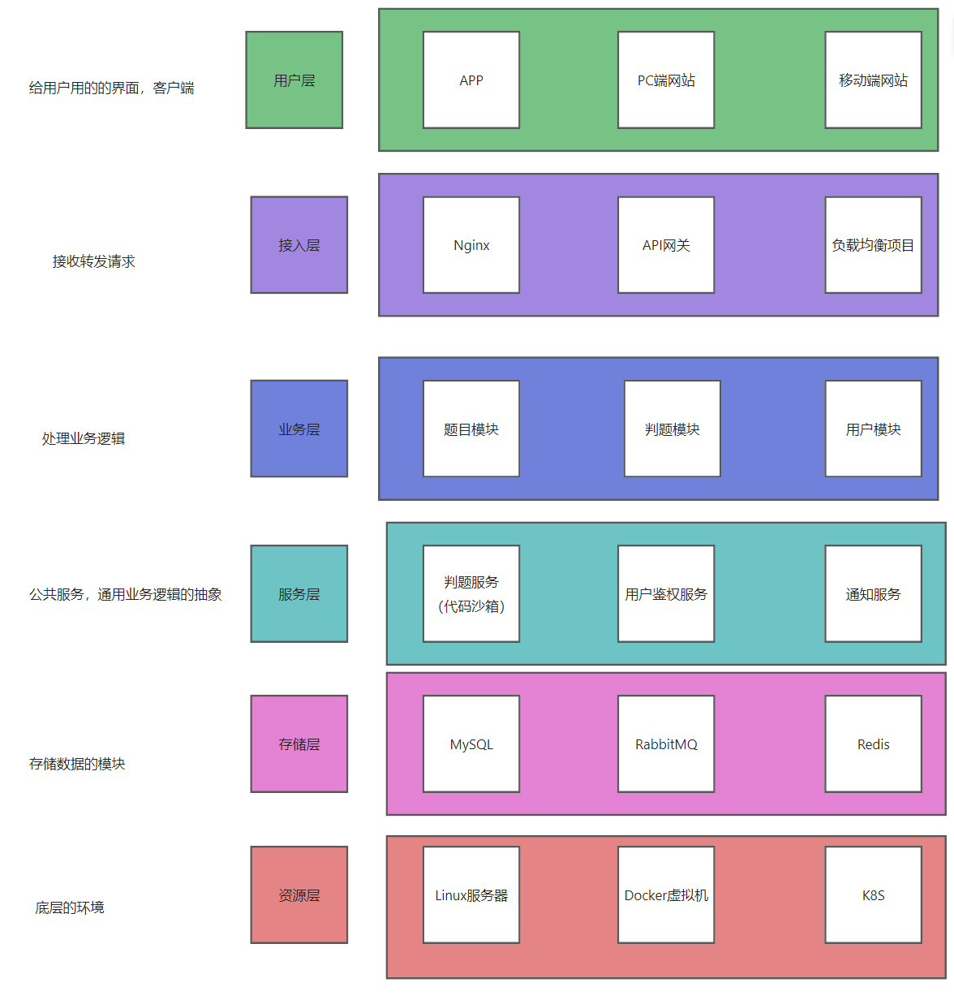

<p align="center">
    <a href="" target="_blank">
      
    </a>
</p>
<h1 align="center">YOJ</h1>
<p align="center"><strong>Ya Online Judge 在线判题评测系统<br><em>持续更新中~</em></strong></p>
<div align="center">
    <a href="https://github.com/IMZHEYA/zhesou-frontend"></a>
    <a href="https://github.com/IMZHEYA/zhesou-backend"></a>
    <a href="https://github.com/IMZHEYA/yoj-code-sandbox"></a>
</div>


# YOJ在线判题系统

> 作者：[诨号无敌鸭](https://github.com/IMZHEYA)

## 项目介绍

本项目是基于 Spring Boot + Docker + Vue 3 的 **编程算法题目在线评测系统**
（简称OJ）。

在线访问：http://106.54.12.71/

YOJ（Ya Online Judge）系统是一个在线算法评测系统，用户可以选择题目、编写代码并提交代码进行评测，而且是高效、稳定的 OJ
在线判题评测系统，它能够根据用户提交的代码、出题人预先设置的题目输入和输出用例，进行编译代码、运行代码、判断代码运行结果是否正确。

## 项目功能 🎊

### 题目模块

1. 创建题目（管理员）
2. 删除题目（管理员）
3. 修改题目（管理员）
4. 搜索题目（用户/管理员）
5. 题目管理（管理员）
6. 在线做题（用户/管理）
7. 提交题目代码（用户/管理）

### 用户模块

1. 注册
2. 登录
3. 用户管理（管理员）

### 判题模块

1. 提交判题：结果是否正确与错误
2. 错误处理：内存益出、安全性、超时
3. 代码沙箱：执行代码，返回执行信息
4. 开放接口：提供一个独立的新服务

### 代码沙箱
- 只负责接受代码和输入，运行代码，返回编译运行的结果，不用管用户提交的程序是否正确(不负责判题)

### OJ系统调研

1. https://github.com/HimitZH/HOJ (适合学习)
2. https://github.com/QingdaoU/OnlineJudge (python，不好学，很成熟)
3. https://github.com/hzxie/voj (在Github上的Start⭐⭐没那么多，没那么成熟，但相对好学)
4. https://github.com/fleaking/uoj (php实现的)
5. https://github.com/zhblue/hustoj (成熟，但是php实现)
6. https://github.com/hydro-dev/Hydro (功能强大，Node.js实现)

## 项目核心亮点 ⭐


1. 代码沙箱（安全沙箱）
    - 用户代码藏毒：写个木马文件、修改系统权限
    - 沙箱：隔离的、安全的环境，用户的代码不会影响到沙箱之外的系统的运行
    - 资源分配：限制用户程序的占用资源
2. 判题规则
    - 题目用例的比对，结果的验证


## 快速启动 🏃‍♂️

1. 下载/拉取本项目到本地（yoj-backend，yoj-frontend,yoj-codesandbox）
2. 通过 IDEA 代码编辑器进行打开项目，等待依赖的下载
3. 修改配置文件 `application.yaml` 的信息，比如数据库等
4. 修改信息完成后，通过 `YOJApplication` 程序进行运行项目

## 项目结构图 🌟



## 项目核心业务流程 🔥

判题服务：获取题目信息、预计的输入输出结果，返回给主业务后端：用户的答案是否正确
代码沙箱：只负责运行代码，给出程序运行的结果，不用管用户提交的程序是否正确。 因此 判题服务 和 代码沙箱 实现了解耦


## 项目技术栈和特点 ❤️‍🔥

### 后端

1. Spring Boot：简化Spring开发框架
2. Spring MVC
3. Spring Boot 调试工具和项目处理器
4. Spring 事务注解
5. MyBatis + MyBatis Plus 数据访问
6. MyBatis-Plus 数据库访问结构
7. Docker 代码沙箱，实现隔离环境运行Java程序
8. Java安全管理器：保护 JVM、Java 安全的机制，实现对资源的操作限制


### 前端

1. Vue 3
2. Vue Router: 路由管理
3. Vue-Cli 脚手架
4. Axios: HTTP客户端
5. Bytemd: Markdown 编辑器
6. Monaco Editor: 代码编辑器
7. highlight.js: 语法高亮
8. Moment.js: 日期处理库
9. Arco Design Vue: UI组件库
10. TypeScript: 静态类型系统

### 数据存储

- MySQL 数据库


### 通用特性

- 全局请求响应拦截器（记录日志）
- 全局异常处理器
- 自定义错误码
- 封装通用响应类
- Swagger + Knife4j 接口文档
- 自定义权限注解 + 全局校验
- 全局跨域处理
- 多环境配置
- IDEA插件 MyBatisX ： 根据数据库表自动生成
- Hutool工具库 、Apache Common Utils、Gson 解析库、Lombok 注解

### 单元测试

- JUnit5 单元测试、业务功能单元测试

### 设计模式

- 静态工厂模式
- 代理模式
- 策略模式
- 模版方法模式

### 远程开发

- VMware Workstation虚拟机
- Ubuntu Linux 18
- Docker环境
- 使用JetBrains Client连接

### 代码沙箱项目目录结构

```
D:.
├─.idea
├─docs
│  └─imgs
├─src
│  ├─main
│  │  ├─java
│  │  │  └─com
│  │  │      └─yupi
│  │  │          └─yojcodesandbox
│  │  │              ├─controller
│  │  │              ├─docker
│  │  │              ├─model
│  │  │              ├─sercurity
│  │  │              ├─unsafe
│  │  │              └─utils
│  │  └─resources
│  │      ├─sercurity
│  │      ├─static
│  │      └─testCode
│  └─test
│      └─java
│          └─com
│              └─yupi
│                  └─yojcodesandbox
├─target
│  ├─classes
│  │  ├─com
│  │  │  └─yupi
│  │  │      └─yojcodesandbox
│  │  │          ├─controller
│  │  │          ├─docker
│  │  │          ├─model
    ├─6b4a2963-df85-498e-9b24-862a9469ff7d
    ├─7642908f-f4d5-44cf-9b15-664bed804a9c
    ├─b1f69250-c31a-451e-adba-dd7eebe46b22
    ├─bfe9a6c5-cf5e-4fa8-821a-d61ea876034a
    └─fd3ac0a6-8490-49e5-8a59-d00afba9e889


```
